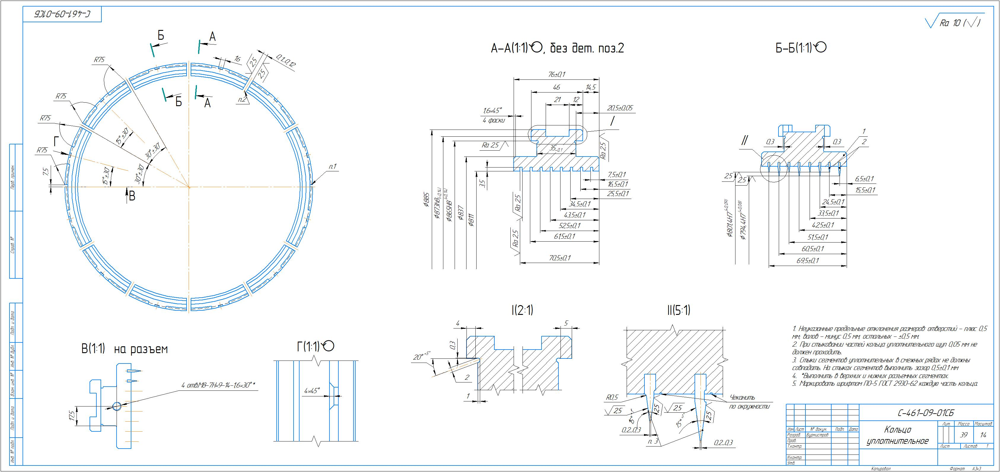
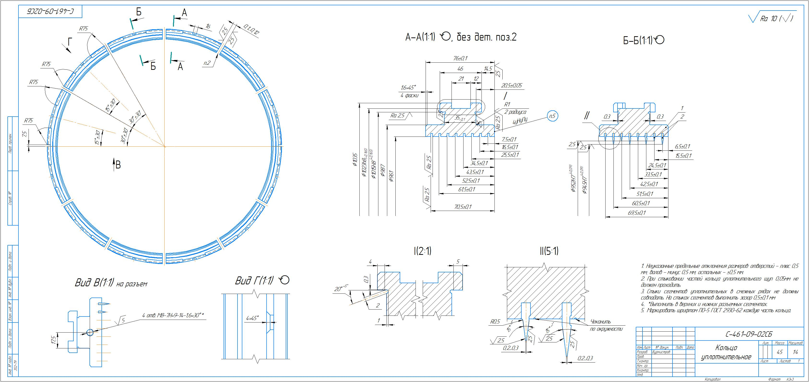
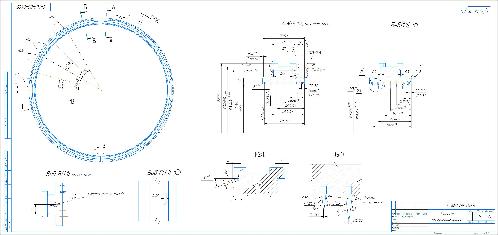
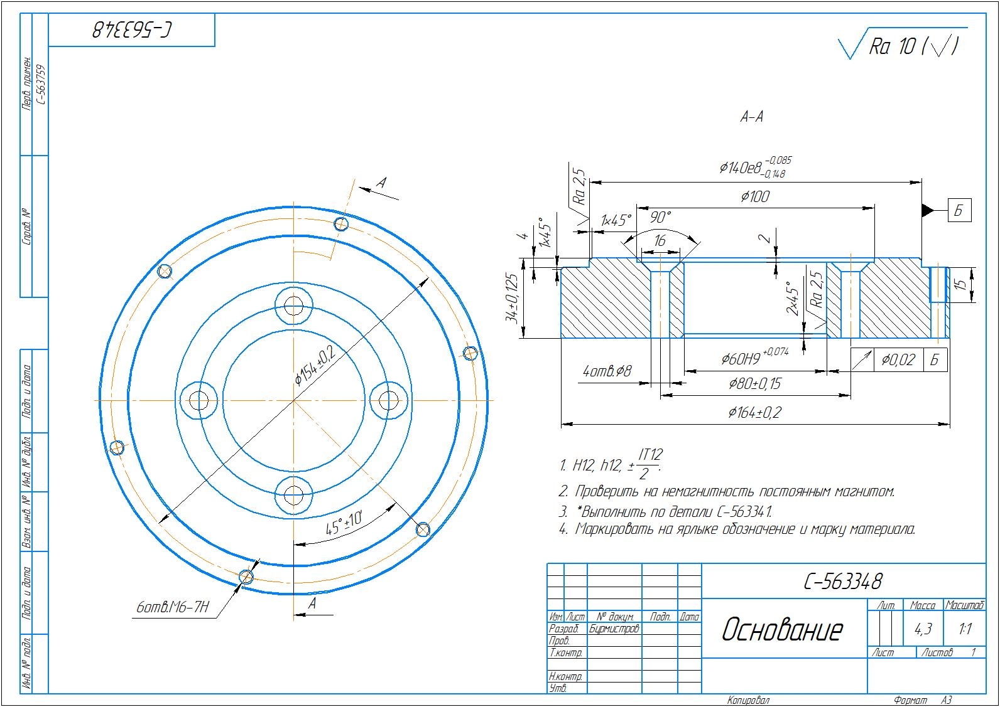
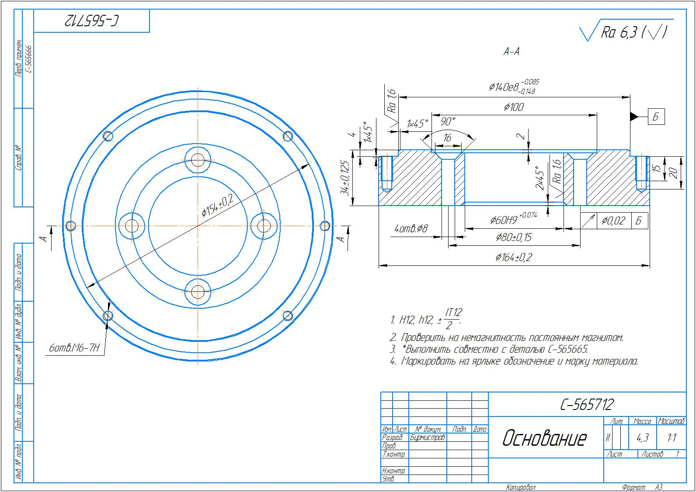
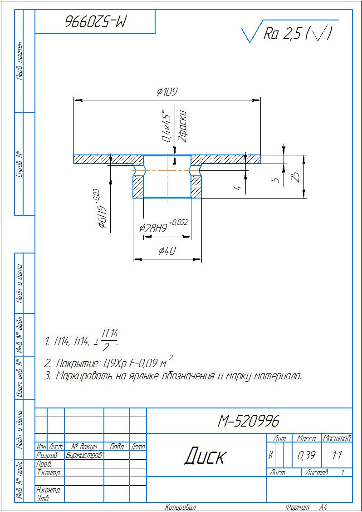
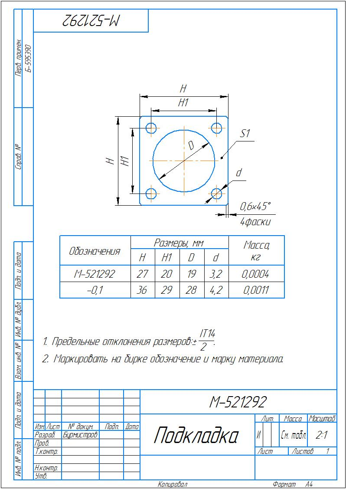

# KZAEM-Drawings / Чертежи КЗАЭМ

> **RU** | [**EN**](#english-version)

---

## 🇷🇺 Русская версия

### О репозитории

Данный репозиторий содержит **технические чертежи**, выполненные в период производственной практики на **Калужском заводе автомобильного электрооборудования (КЗАЭМ)**.

Работа выполнена студентом **МГТУ им. Н.Э. Баумана**.

---

### Структура репозитория

```
KZAEM-Drawings/
├── drawings/
│   ├── rings/          # Кольца уплотнительные (С-461-09-хх)
│   │   ├── C-461-09-01SB_Sealing_Ring.jpg
│   │   ├── C-461-09-02SB_Sealing_Ring.jpg
│   │   └── C-461-09-04SB_Sealing_Ring.jpg
│   └── parts/          # Прочие детали
│       ├── C-563348_Base.jpg
│       ├── C-565712_Base.jpg
│       ├── M-520996_Disk.jpg
│       └── M-521292_Pad.jpg
├── README.md
└── LICENSE
```

---

### Раздел 1 — Кольца уплотнительные

Группа сборочных узлов **С-461-09** — кольца уплотнительные, применяемые в узлах уплотнения электрических машин и агрегатов, производимых на КЗАЭМ.

---

#### C-461-09-01СБ — Кольцо уплотнительное

| Параметр | Значение |
|---|---|
| Обозначение | С-461-09-01СБ |
| Тип | Кольцо уплотнительное (сборочный чертёж) |
| Применение | Уплотнение вращающихся и статичных соединений |
| Формат | ГОСТ, лист А3 |



*Чертёж сборочного узла уплотнительного кольца C-461-09-01СБ*

---

#### C-461-09-02СБ — Кольцо уплотнительное

| Параметр | Значение |
|---|---|
| Обозначение | С-461-09-02СБ |
| Тип | Кольцо уплотнительное (сборочный чертёж) |
| Применение | Уплотнение соединений в агрегатах КЗАЭМ |
| Формат | ГОСТ, лист А3 |



*Чертёж сборочного узла уплотнительного кольца C-461-09-02СБ*

---

#### C-461-09-04СБ — Кольцо уплотнительное

| Параметр | Значение |
|---|---|
| Обозначение | С-461-09-04СБ |
| Тип | Кольцо уплотнительное (сборочный чертёж) |
| Применение | Уплотнение соединений в агрегатах КЗАЭМ |
| Формат | ГОСТ, лист А3 |



*Чертёж сборочного узла уплотнительного кольца C-461-09-04СБ*

---

### Раздел 2 — Прочие детали

---

#### C-563348 — Основание

| Параметр | Значение |
|---|---|
| Обозначение | С-563348 |
| Тип | Основание |
| Применение | Несущая деталь корпусного узла агрегата |
| Формат | ГОСТ, лист А3 |



*Чертёж детали «Основание» С-563348*

---

#### C-565712 — Основание

| Параметр | Значение |
|---|---|
| Обозначение | С-565712 |
| Тип | Основание |
| Применение | Несущая деталь корпусного узла агрегата |
| Формат | ГОСТ, лист А3 |



*Чертёж детали «Основание» С-565712*

---

#### M-520996 — Диск

| Параметр | Значение |
|---|---|
| Обозначение | М-520996 |
| Тип | Диск |
| Применение | Вращающаяся деталь трансмиссионного или электрического узла |
| Формат | ГОСТ, лист А3 |



*Чертёж детали «Диск» М-520996*

---

#### M-521292 — Подкладка

| Параметр | Значение |
|---|---|
| Обозначение | М-521292 |
| Тип | Подкладка |
| Применение | Дистанционная или уплотнительная прокладочная деталь |
| Формат | ГОСТ, лист А3 |



*Чертёж детали «Подкладка» М-521292*

---

### Об авторе

| | |
|---|---|
| **Университет** | МГТУ им. Н.Э. Баумана |
| **Предприятие** | Калужский завод автомобильного электрооборудования (КЗАЭМ) |
| **Тип работы** | Производственная практика / учебные чертежи |
| **Стандарт оформления** | ГОСТ 2.хх (ЕСКД) |

---

### Лицензия

Все материалы защищены авторским правом. Подробнее — см. [LICENSE](LICENSE).

---
---

## English Version

### About

This repository contains **engineering drawings** created during an industrial internship at **KZAEM — Kaluga Plant of Automotive Electrical Equipment**.

Author is a student of **Bauman Moscow State Technical University (BMSTU)**.

---

### Repository Structure

```
KZAEM-Drawings/
├── drawings/
│   ├── rings/          # Sealing rings (С-461-09-xx series)
│   │   ├── C-461-09-01SB_Sealing_Ring.jpg
│   │   ├── C-461-09-02SB_Sealing_Ring.jpg
│   │   └── C-461-09-04SB_Sealing_Ring.jpg
│   └── parts/          # Other parts
│       ├── C-563348_Base.jpg
│       ├── C-565712_Base.jpg
│       ├── M-520996_Disk.jpg
│       └── M-521292_Pad.jpg
├── README.md
└── LICENSE
```

---

### Section 1 — Sealing Rings

The **С-461-09** assembly series — sealing rings used in sealing units of electrical machines and assemblies manufactured at KZAEM.

---

#### C-461-09-01SB — Sealing Ring

| Parameter | Value |
|---|---|
| Drawing No. | С-461-09-01СБ |
| Type | Sealing ring (assembly drawing) |
| Application | Sealing of rotating and static joints |
| Standard | GOST (ESKD), A3 sheet |


*Assembly drawing of sealing ring C-461-09-01SB*

---

#### C-461-09-02SB — Sealing Ring

| Parameter | Value |
|---|---|
| Drawing No. | С-461-09-02СБ |
| Type | Sealing ring (assembly drawing) |
| Application | Sealing of joints in KZAEM assemblies |
| Standard | GOST (ESKD), A3 sheet |


*Assembly drawing of sealing ring C-461-09-02SB*

---

#### C-461-09-04SB — Sealing Ring

| Parameter | Value |
|---|---|
| Drawing No. | С-461-09-04СБ |
| Type | Sealing ring (assembly drawing) |
| Application | Sealing of joints in KZAEM assemblies |
| Standard | GOST (ESKD), A3 sheet |


*Assembly drawing of sealing ring C-461-09-04SB*

---

### Section 2 — Other Parts

---

#### C-563348 — Base

| Parameter | Value |
|---|---|
| Drawing No. | С-563348 |
| Type | Base / Housing part |
| Application | Load-bearing element of the assembly housing |
| Standard | GOST (ESKD), A3 sheet |


*Engineering drawing of part "Base" C-563348*

---

#### C-565712 — Base

| Parameter | Value |
|---|---|
| Drawing No. | С-565712 |
| Type | Base / Housing part |
| Application | Load-bearing element of the assembly housing |
| Standard | GOST (ESKD), A3 sheet |


*Engineering drawing of part "Base" C-565712*

---

#### M-520996 — Disk

| Parameter | Value |
|---|---|
| Drawing No. | М-520996 |
| Type | Disk |
| Application | Rotating part of a transmission or electrical assembly |
| Standard | GOST (ESKD), A3 sheet |


*Engineering drawing of part "Disk" M-520996*

---

#### M-521292 — Pad

| Parameter | Value |
|---|---|
| Drawing No. | М-521292 |
| Type | Pad / Shim |
| Application | Spacer or sealing gasket element |
| Standard | GOST (ESKD), A3 sheet |


*Engineering drawing of part "Pad" M-521292*

---

### About the Author

| | |
|---|---|
| **University** | Bauman Moscow State Technical University (BMSTU) |
| **Company** | KZAEM — Kaluga Plant of Automotive Electrical Equipment |
| **Work type** | Industrial internship / educational engineering drawings |
| **Drawing standard** | GOST 2.xx (ESKD — Unified System of Design Documentation) |

---

### License

All materials are copyright protected. See [LICENSE](LICENSE) for details.
